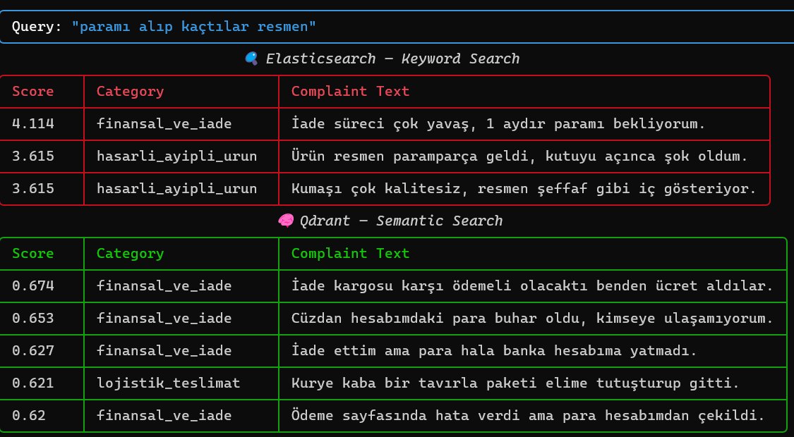
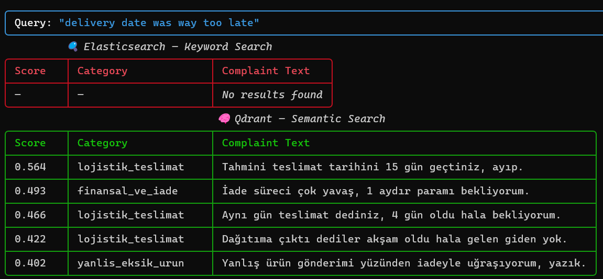

1. What is this tool?
Qdrant is a high-performance, open-source vector database and similarity search engine written in Rust. It is specifically designed to store, manage, and search high-dimensional vector embeddings, making it an essential tool for AI-native data engineering pipelines and semantic search applications. Unlike traditional keyword-based search engines, Qdrant utilizes advanced algorithms like HNSW to find conceptual similarities between data points in real-time.

## 2. Prerequisites
To run this example, ensure you have the following environment:

* **Operating System:** Windows 11 with **WSL2** (Ubuntu 22.04 or similar recommended).
* **Docker:** Version 29.2.0 or higher (Running via Docker Desktop or Docker Engine in WSL).
* **Docker Compose:** Version 2.0.0 or higher.
* **Python:** Version 3.9 or higher (Installed within the WSL environment).
* **Pip:** Latest version.

## 🚀 Installation & Running the Example

Follow these steps in your **WSL terminal** to set up and run the entire pipeline.

---

## 1️⃣ Clone Repository & Start Infrastructure

```bash
# Clone the repository
git clone https://github.com/itu-itis23-gokcea23/qdrant-vs-elasticsearch-deduplication.git

# Navigate into project folder
cd qdrant-vs-elasticsearch-deduplication

# Start Docker containers (Qdrant & Elasticsearch)
docker compose up -d

# Create virtual environment
python3 -m venv venv

# Activate virtual environment
source venv/bin/activate

# Upgrade pip
pip install --upgrade pip

# Install dependencies
pip install -r requirements.txt

# 1. Generate synthetic complaints data
python3 scripts/generate_data.py

# 2. Load data into Qdrant (Vector Store)
python3 scripts/load_qdrant.py

# 3. Load data into Elasticsearch (Keyword Store)
python3 scripts/load_elasticsearch.py

# Run comparison with any query which you want to try
python3 scripts/search_compare.py --query "kargom paramparça gelmiş" 


```
## 5. Expected Output

When you run the `search_compare.py` script, the system compares traditional keyword search (Elasticsearch) with semantic vector search (Qdrant).

**Sample Terminal Output:**






## 🤖 AI Usage Disclosure

### Tools Used
- Gemini 3 Flash (Google)
- ChatGPT (OpenAI)

### Purpose
AI tools were used for the following tasks:

- Generating the synthetic Turkish e-commerce complaint dataset   
- Structuring and writing the Python logic for comparison between Elasticsearch and Qdrant  
- Formatting and refining this README for technical clarity